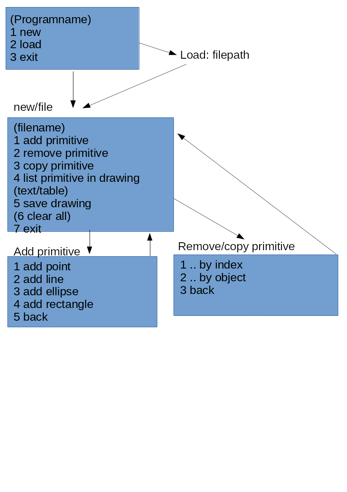

# Graphic

### Log
#### Tag1
- erstellen der **primitiven** Graphic-Klassen **Point**, **Line**, **Oval**, **Rectangle**

- constructor, getter und setter der Primitiven Graphic-Klassen

- erstellen der Klasse **Draw** in der Objekte aus den primitiven Graphic-Klassen in einer ArrayList gespeichert werden 
können

- get, add, remove in Draw implementiert

- schreiben von Tests für die Methoden der Klassen

####Tag2
- git tag, git pull

- Diskussion/Wiederholung Tag1

- Observer Pattern besprochen, UML-Diagramm Observer Pattern für Graphic

- Observer Pattern implementiert

- Tests aktualisiert bzw neue Tests zum Observer

####Tag3
- Überarbeitung des Observer Patterns

- Wiederholung Tage 1-3

- Überarbeiten des gesamten Codes, toString in den primitiven Klassen, copyConstructor

- in Rectangle ein constructor für Quadrate, in Oval ein constructor für Kreise

#### Tag4

- Wiederholung der Vorwoche
- Grafikentwurf eines Menüsystems für Kommandozeilentool:

### nice to know (for me)
#### git tags

- erstellen: git tag -a "name" -m "Message"

- pushen:    git push origin --tags

#### Tests
- @Test

- @ParameterizedTest          -> Test mit (mehreren) Parametern

- @MethodSource("quelle")     -> Parameter werden aus Quelle bezogen

#### remove with equals
- entfernt vielleicht nicht das gewünschte Objekt, 
da vielleicht Variablen gleich aber anderer Speicherplatz also anderes Objekt

#### Object

- Member erstmal auf private und am besten dabei lassen

### useful Links

- [JUnit5 User Guide](https://junit.org/junit5/docs/current/user-guide/)

- [Git Guide](https://git-scm.com/book/de/v2)

- [Auswahl an Design Patterns](https://www.philipphauer.de/study/se/design-pattern.php)

- [Java ist auch eine Insel Online Book](http://openbook.rheinwerk-verlag.de/javainsel9/)